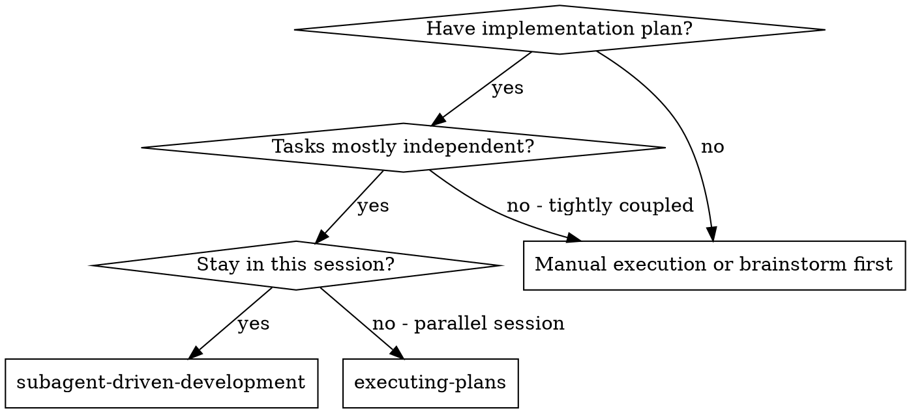

# Subagent-Driven Development

Execute implementation plans with subagents while keeping harness todos flat and applying proportional review at meaningful task boundaries.

**Why subagents:** You delegate work to specialized agents with isolated context. By precisely crafting their instructions and context, you keep them focused while preserving your own context for coordination.

**Core principle:** Flat dependency-ordered todos + proportional review = high quality without cold-start review loops on tiny tasks.

## When to Use



**vs. Executing Plans:**
- Same session coordination
- Fresh subagents where they add value
- Lite checkpoints after simple tasks, full task-scope spec review plus lite task-scope code review at task boundaries
- Faster iteration without human-in-loop between every small task

## The Process

1. Read the plan once.
2. Extract task groups, tasks, dependencies, validation commands, and review policies.
3. Replace any prior planning/brainstorming todos with one flat TodoWrite list.
4. Execute each flat todo in dependency order.
5. Run lite checkpoints for simple task todos.
6. Run full task-scope spec review and lite task-scope code review at task boundaries.
7. Run final full implementation review and validation across all tasks.
8. Invoke `superpowers:finishing-a-development-branch`, preserving whether execution happened on the current branch or in a temporary worktree/task branch.

## Todo Status Discipline

Keep the flat harness todo list current throughout orchestration:

1. Mark exactly one flat todo `in_progress` immediately before starting or dispatching that work.
2. Mark it `completed` immediately after its implementation, review, or validation is done.
3. Do not start the next todo, dispatch the next subagent, or report completion while the previous todo is still stale.

## Flat Todo Shape

Most harnesses do not support nested todos. Preserve conceptual groups with parent `Task N` labels and dependency-ordered `Task N.M` subtasks:

```markdown
- Execution setup: read plan, classify groups, prepare context
- Task 1.1: Add failing login validation tests
- Task 1.1: Lite review checkpoint
- Task 1.2: Implement login endpoint
- Task 1.2: Lite review checkpoint
- Task 1: Full spec review
- Task 1: Lite code review
- Task 2.1: Add password reset tests
- Task 2.1: Lite review checkpoint
- Task 2: Full spec review
- Task 2: Lite code review
- Final: full task-set spec review
- Final: full task-set code review
- Final: unit/e2e validation
- Finalize: complete on current branch or prompt for worktree merge/cleanup choice
```

Do not create nested todo structures. Do not use `Group N` in harness todos; use `Task N` for the parent scope and `Task N.M` for its subtasks. Do not expand every plan checkbox into a harness todo unless the checkbox is a real dependency boundary.

## Review Policy

Use the cheapest review that matches the risk:

| Work type | Review |
|---|---|
| Mechanical or simple task | One lite review checkpoint, using `lite-spec-reviewer` and/or `lite-code-reviewer` only when useful |
| Normal task scope | Full spec review + lite code review after task validation |
| High-risk task | Full spec review + full code review before moving on |
| Final implementation | Full task-set spec review + full task-set code review + validation |

High-risk means security, auth, data loss, migrations, broad refactors, cross-cutting behavior, unresolved design judgment, or unexpected file changes.

If a lite review finds a concern, escalate that task scope to full spec and/or full code review before moving on.

## Reviewer Routing

- Lite review checkpoint: dispatch `lite-spec-reviewer`, `lite-code-reviewer`, both, or neither based on the task's risk and the implementer's report. Do not split lite checks into multiple harness todos unless they are real dependency boundaries.
- Lite code review: dispatch `lite-code-reviewer` across the completed parent task scope.
- Full spec review: dispatch `spec-reviewer`.
- Full code review: dispatch `code-reviewer`.

For platforms without named agents, use the matching prompt templates in this skill directory.

## Model Selection

Use the least powerful model that can handle each role to conserve cost and increase speed.

**Mechanical implementation tasks** (isolated functions, clear specs, 1-2 files): use a fast, cheap model.

**Integration and judgment tasks** (multi-file coordination, pattern matching, debugging): use a standard model.

**Architecture, design, and full review tasks**: use the most capable available model.

## Handling Implementer Status

Implementer subagents report one of four statuses. Handle each appropriately:

**DONE:** Proceed to the task's review policy: lite checkpoint for simple work, full review for high-risk work, or task-scope review when the parent task boundary is reached.

**DONE_WITH_CONCERNS:** Read the concerns before proceeding. If they affect correctness, scope, or validation, escalate to full review before moving on.

**NEEDS_CONTEXT:** Provide the missing context and re-dispatch.

**BLOCKED:** Assess the blocker:
1. If it's a context problem, provide more context and re-dispatch with the same model
2. If the task requires more reasoning, re-dispatch with a more capable model
3. If the task is too large, break it into smaller pieces
4. If the plan itself is wrong, escalate to the human

**Never** ignore an escalation or force the same model to retry without changes.

## Prompt Templates

- `./implementer-prompt.md` - Dispatch implementer subagent
- `./spec-reviewer-prompt.md` - Full spec compliance review fallback
- `./code-quality-reviewer-prompt.md` - Full code quality review fallback
- `./lite-spec-reviewer-prompt.md` - Lite spec checkpoint fallback
- `./lite-code-reviewer-prompt.md` - Lite code checkpoint fallback

## Example Workflow

```markdown
You: I'm using Subagent-Driven Development to execute this plan.

[Read plan file once: docs/superpowers/plans/feature-plan.md]
[Extract groups and tasks with full text and context]
[Create flat TodoWrite with setup, Task N.M subtasks, Task N reviews, final validation, and finalize items]

Task 1.1: Hook installation script
[Dispatch implementation subagent with full task text + context]
Implementer: DONE, tests passing, committed.

Task 1.1: Lite review checkpoint
[Dispatch lite-spec-reviewer and/or lite-code-reviewer if useful]
Lite checkpoint: Pass

Task 1: Full spec review
[Dispatch spec-reviewer across all Task 1 changes]
Result: Approved

Task 1: Lite code review
[Dispatch lite-code-reviewer across all Task 1 changes]
Result: Approved

Final: full task-set spec review
Final: full task-set code review
Final: unit/e2e validation
Finalize: invoke finishing-a-development-branch
```

## Red Flags

**Never:**
- Start implementation on main/master branch without explicit user consent
- Treat current-branch execution as a worktree cleanup/merge flow
- Create nested TodoWrite structures; use flat labels instead
- Skip the review required by the task review policy
- Proceed with unfixed full-review issues
- Dispatch multiple implementation subagents in parallel if they can conflict
- Make subagents read the plan file; provide full text instead
- Skip scene-setting context
- Ignore subagent questions
- Let implementer self-review replace required task-scope or final review
- Move past a task scope while required review has open issues

**If reviewer finds issues:**
- Implementer or fix subagent fixes them
- Reviewer reviews again
- Repeat until approved or escalate to the human

## Integration

**Required workflow skills:**
- **superpowers:writing-plans** - Creates the plan this skill executes
- **superpowers:requesting-spec-review** - Spec compliance review routing for lite and full spec reviews
- **superpowers:requesting-code-review** - Code review guidance for full code reviews
- **superpowers:finishing-a-development-branch** - Complete development after all tasks

**Subagents should use:**
- **superpowers:test-driven-development** - Subagents follow TDD for implementation tasks when the plan requires it

**Alternative workflow:**
- **superpowers:executing-plans** - Use for inline execution instead of subagent-driven execution
