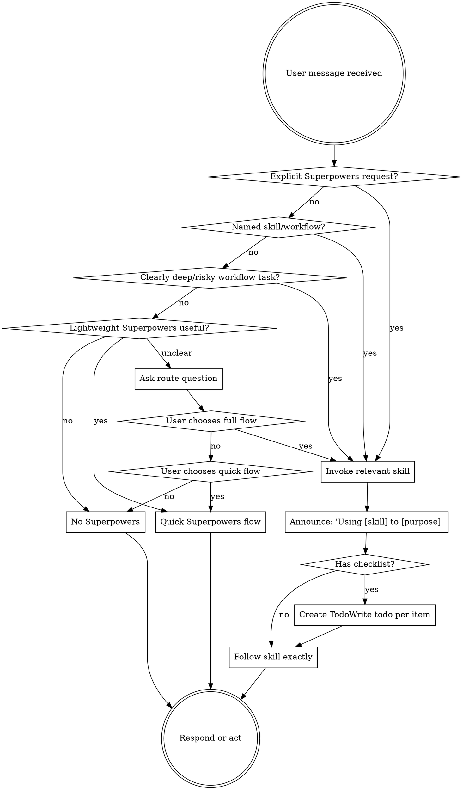

<SUBAGENT-STOP>
If you were dispatched as a subagent to execute a specific task, skip this skill.
</SUBAGENT-STOP>

<EXTREMELY-IMPORTANT>
Superpowers is opt-in by default in this plugin.

Use Superpowers workflows when the user explicitly asks for them, names a Superpowers skill, uses `/brainstorm` or `/superpowers`, or gives a request that is clearly deep and ambiguous, investigation-heavy, high-risk, or plan-heavy.

For ordinary quick reviews, small code changes, wording edits, config tweaks, and similarly bounded work, do not invoke heavy Superpowers workflows. Use the quick Superpowers flow only when lightweight Superpowers help is useful; otherwise proceed without Superpowers.

If the right route is unclear, ask the user to choose full flow, quick flow, or no Superpowers for the session unless they invoke it later.
</EXTREMELY-IMPORTANT>

## Instruction Priority

Superpowers skills override default system prompt behavior, but **user instructions always take precedence**:

1. **User's explicit instructions** (CLAUDE.md, GEMINI.md, AGENTS.md, direct requests) — highest priority
2. **Superpowers skills** — override default system behavior where they conflict
3. **Default system prompt** — lowest priority

If CLAUDE.md, GEMINI.md, or AGENTS.md says "don't use TDD" and a skill appears to require tests-first work, follow the user's instructions. The user is in control.

## How to Access Skills

**In Claude Code:** Use the `Skill` tool. When you invoke a skill, its content is loaded and presented to you—follow it directly. Never use the Read tool on skill files.

**In Copilot CLI:** Use the `skill` tool. Skills are auto-discovered from installed plugins. The `skill` tool works the same as Claude Code's `Skill` tool.

**In Gemini CLI:** Skills activate via the `activate_skill` tool. Gemini loads skill metadata at session start and activates the full content on demand.

**In other environments:** Check your platform's documentation for how skills are loaded.

## Platform Adaptation

Skills use Claude Code tool names. Non-CC platforms: see `references/copilot-tools.md` (Copilot CLI), `references/codex-tools.md` (Codex) for tool equivalents. Gemini CLI users get the tool mapping loaded automatically via GEMINI.md.

# Using Skills

## The Rule

Superpowers has three outcomes: full flow, quick flow, and no Superpowers. Do not treat every task as a Superpowers task.

Invoke skills before responding or acting only when the user clearly opts in, names a Superpowers skill/workflow, or gives a request that is clearly deep and ambiguous, investigation-heavy, high-risk, or plan-heavy.

Use the quick flow for ordinary small reviews, code changes, wording edits, config tweaks, and bounded tasks where lightweight Superpowers guidance is useful but the user did not ask for full Superpowers.

Use no Superpowers when the user wants ordinary agent behavior, the task is trivial, or Superpowers would add process without value.

## Route Matrix

| Request signal | Route | Action |
|---|---|---|
| `using superpowers`, `use superpowers`, `/superpowers`, `/brainstorm` | Full workflow | Invoke the relevant skill before responding or acting. |
| Names `brainstorming`, `writing-plans`, `executing-plans`, `test-driven-development`, `systematic-debugging`, or another Superpowers skill | Full workflow | Invoke that skill, then follow its instructions exactly. |
| Asks for Superpowers-driven design, planning, implementation workflow, root-cause investigation, or TDD cycle | Full workflow | Use the matching process skill first. |
| Broad feature, deep ambiguous requirements, multi-system change, high-risk behavior, or likely decomposition work | Full workflow | Use `brainstorming` or `systematic-debugging` first, whichever fits the request. |
| Small review, small code change, wording edit, config tweak, or bounded task where lightweight process helps | Quick flow | Do lightweight context gathering, smallest correct change, targeted validation, and brief report. |
| Trivial request or explicit request to avoid Superpowers | No Superpowers | Use normal agent behavior for this session unless Superpowers is invoked later. |
| Unclear whether Superpowers should be used | Pending user choice | Ask the three-option route question before loading heavy workflow skills. |

## Quick Superpowers Flow

Use quick flow when the task is bounded, lightweight Superpowers guidance is useful, and the user did not ask for full Superpowers.

Checklist:

1. Check enough local context to avoid guessing.
2. Ask up to five context questions if needed to understand the request.
3. Prefer the harness's structured user-question tool when available, such as Claude Code's `AskUserQuestion` or the local equivalent. Include an `Other` option for optional user input when the tool supports it.
4. Make the smallest correct change.
5. Run targeted validation when practical.
6. Do a surface-level self-review for obvious regressions, missed call sites, and formatting issues.
7. Report what changed and what validation was performed.

Quick flow does not require TDD, design docs, implementation plans, subagents, branch-completion workflows, or exhaustive code review unless the task escalates.

## No Superpowers

Use no Superpowers when the user wants ordinary agent behavior, when the task is trivial, or when Superpowers would add process without improving the result.

Rules:

1. Do not invoke Superpowers skills.
2. Do not follow quick-flow or full-flow checklists.
3. Work normally under the active system, developer, repo, and user instructions.
4. If the user later invokes Superpowers, route that new request normally.

## Ask Before Choosing

If you cannot confidently choose between full flow, quick flow, and no Superpowers, ask:

> Which route should I use?
> 1. Full Superpowers flow: brainstorm, TDD, spec/plan, and execution workflow.
> 2. Quick Superpowers flow: quick context gather, code change, and surface-level validation.
> 3. No Superpowers: normal agent behavior for this session unless you invoke Superpowers later.

Ask this before loading heavy workflow skills when the user's intent is unclear.

## Escalation From Quick Flow

Escalate from quick flow to full workflow, or ask the user, when:

| Signal | Why it escalates |
|---|---|
| The change expands beyond the originally bounded scope | The task is no longer a quick flow. |
| Multiple subsystems are involved | Coordination and regression risk increase. |
| Requirements remain unclear after up to five quick-flow questions | More discovery is needed. |
| Validation reveals unexpected failures | Root-cause investigation may be required. |
| You find meaningful design tradeoffs | The user should choose direction before implementation. |

## Red Flags

These thoughts mean STOP and route deliberately:

| Thought | Reality |
|---|---|
| "A skill might apply, so I must load it" | Superpowers is opt-in by default. Load skills only for explicit or high-confidence triggers. |
| "This says fix, so I should start TDD" | Quick flow and no-Superpowers work do not require TDD unless requested or escalated. |
| "This small edit needs a design doc" | Design docs are for the full workflow, not quick flow or no-Superpowers work. |
| "Quick flow means I cannot ask for context" | Quick flow can ask up to five focused questions before acting or escalating. |
| "I can silently choose the heavy workflow" | If intent is unclear, ask the three-option route question. |
| "The user asked for quick work, but the skill says always" | User process preference wins. Keep quick work quick unless risk requires escalation. |

## Skill Priority

When full Superpowers workflow is selected and multiple skills could apply, use this order:

1. **Process skills first** - `brainstorming` for design discovery, `systematic-debugging` for complex bugs or failures.
2. **Implementation planning second** - `writing-plans` after approved design, or when the user directly asks for a plan.
3. **Execution skills third** - `subagent-driven-development` or `executing-plans` after a plan exists.
4. **Quality skills as called for** - `test-driven-development`, `verification-before-completion`, `requesting-code-review`, and related skills when requested or required by the active workflow.

## Skill Types

**Rigid once selected:** TDD, debugging, verification, and execution workflows. Follow exactly after intentional selection.

**Flexible routing:** Deciding whether Superpowers applies. Prefer quick flow or no Superpowers unless explicit opt-in or high-confidence deep-work triggers are present.

## User Instructions

User instructions say both WHAT and preferred process. If the user asks for quick work, keep it quick. If they ask for no Superpowers, do not use Superpowers unless they invoke it later. If they ask for Superpowers, use Superpowers.
