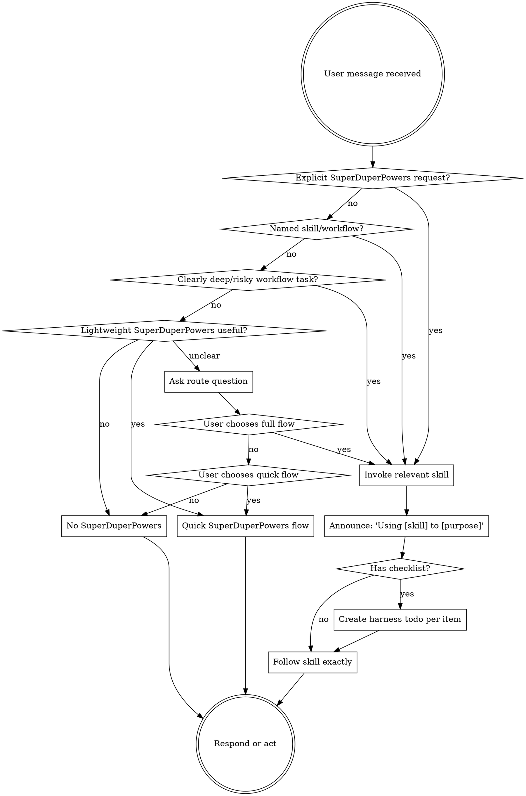

<SUBAGENT-STOP>
If you were dispatched as a subagent to execute a specific task, skip this skill.
</SUBAGENT-STOP>

<EXTREMELY-IMPORTANT>
SuperDuperPowers is opt-in by default in this plugin.

`superpowers`, `Superpowers`, `SuperPowers`, `superduperpowers`, `SuperDuperPowers`, `/superpowers`, `/superduperpowers`, and `/brainstorm` all invoke the same SuperDuperPowers routing family. Use `SuperDuperPowers` in user-facing prose; keep `superpowers:*` only as the compatibility skill namespace for concrete skill identifiers.

Use SuperDuperPowers workflows when the user explicitly asks for them, names a SuperDuperPowers skill, uses `/brainstorm`, `/superpowers`, or `/superduperpowers`, or gives a request that is clearly deep and ambiguous, investigation-heavy, high-risk, or plan-heavy.

For ordinary quick reviews, small code changes, wording edits, config tweaks, and similarly bounded work, do not invoke heavy SuperDuperPowers workflows. Use the quick SuperDuperPowers flow only when lightweight SuperDuperPowers help is useful; otherwise proceed without SuperDuperPowers.

If the right route is unclear, ask the user to choose full flow, quick flow, or no SuperDuperPowers for the session unless they invoke it later.
</EXTREMELY-IMPORTANT>

When a workflow profile tool is available, initialize or read the profile at the first meaningful route decision. Record route, naming policy, generated-doc policy, runtime path defaults, branch policy, question policy, and `testingIntensity: major-behavior` unless the user explicitly chooses another intensity.

If SuperDuperPowers is invoked and the user did not explicitly choose full, quick, or no workflow, ask a structured route question through the active harness's question tool:

1. Full Brainstorming
2. Quick Implementation
3. No SuperDuperPowers

## Instruction Priority

SuperDuperPowers skills override default system prompt behavior, but **user instructions always take precedence**:

1. **User's explicit instructions** (AGENTS.md, direct requests, or other active repo instructions) — highest priority
2. **SuperDuperPowers skills** — override default system behavior where they conflict
3. **Default system prompt** — lowest priority

If AGENTS.md or another active repo instruction says "don't use TDD" and a skill appears to require tests-first work, follow the user's instructions. The user is in control.

## How to Access Skills

Use the active harness's skill-loading mechanism. When you invoke a skill, its content is loaded and presented to you; follow it directly.

If the active harness does not expose a skill-loading tool, follow that platform's documented local equivalent or the installed plugin's runtime instructions.

## Platform Adaptation

Canonical workflow language describes intent first. Harness-specific tool names are examples. When a skill mentions a tool that is unavailable in the active harness, use the active harness equivalent, documented local equivalent, or fallback workflow for that capability. The OpenCode plugin injects OpenCode-specific tool mapping at runtime.

# Using Skills

## The Rule

SuperDuperPowers has three outcomes: full flow, quick flow, and no SuperDuperPowers. Do not treat every task as a SuperDuperPowers task.

Invoke skills before responding or acting only when the user clearly opts in, names a SuperDuperPowers skill/workflow, or gives a request that is clearly deep and ambiguous, investigation-heavy, high-risk, or plan-heavy.

Use the quick flow for ordinary small reviews, code changes, wording edits, config tweaks, and bounded tasks where lightweight SuperDuperPowers guidance is useful but the user did not ask for full SuperDuperPowers.

Use no SuperDuperPowers when the user wants ordinary agent behavior, the task is trivial, or SuperDuperPowers would add process without value.

When a harness todo list exists, keep it current: mark exactly one item `in_progress` before starting that work, and mark it `completed` immediately before moving to the next item or reporting completion.

## Route Matrix

| Request signal | Route | Action |
|---|---|---|
| `using superpowers`, `use superpowers`, `using superduperpowers`, `use superduperpowers`, `/superpowers`, `/superduperpowers`, `/brainstorm` | Full workflow | Invoke the relevant skill before responding or acting. |
| Names `brainstorming`, `writing-plans`, `executing-plans`, `test-driven-development`, `systematic-debugging`, or another SuperDuperPowers skill | Full workflow | Invoke that skill, then follow its instructions exactly. |
| Asks for SuperDuperPowers-driven design, planning, implementation workflow, root-cause investigation, or TDD cycle | Full workflow | Use the matching process skill first. |
| Broad feature, deep ambiguous requirements, multi-system change, high-risk behavior, or likely decomposition work | Full workflow | Use `brainstorming` or `systematic-debugging` first, whichever fits the request. |
| Small review, small code change, wording edit, config tweak, or bounded task where lightweight process helps | Quick flow | Do lightweight context gathering, smallest correct change, targeted validation, and brief report. |
| Trivial request or explicit request to avoid SuperDuperPowers | No SuperDuperPowers | Use normal agent behavior for this session unless SuperDuperPowers is invoked later. |
| Unclear whether SuperDuperPowers should be used | Pending user choice | Ask the three-option route question before loading heavy workflow skills. |

## Quick SuperDuperPowers Flow

Use quick flow when the task is bounded, lightweight SuperDuperPowers guidance is useful, and the user did not ask for full SuperDuperPowers.

Checklist:

For multi-step quick-flow work, keep a short flat harness todo list and update each item's status immediately as work starts and completes.

1. Check enough local context to avoid guessing.
2. Ask up to five context questions if needed to understand the request.
3. Prefer the active harness's structured user-question tool when available. Include an `Other` option for optional user input when the tool supports it.
4. Make the smallest correct change.
5. Run targeted validation when practical.
6. Do a surface-level self-review for obvious regressions, missed call sites, and formatting issues.
7. Report what changed and what validation was performed.

Quick flow does not require TDD, design docs, implementation plans, subagents, branch-completion workflows, or exhaustive code review unless the task escalates.

## No SuperDuperPowers

Use no SuperDuperPowers when the user wants ordinary agent behavior, when the task is trivial, or when SuperDuperPowers would add process without improving the result.

Rules:

1. Do not invoke SuperDuperPowers skills.
2. Do not follow quick-flow or full-flow checklists.
3. Work normally under the active system, developer, repo, and user instructions.
4. If the user later invokes SuperDuperPowers, route that new request normally.

## Ask Before Choosing

If you cannot confidently choose between full flow, quick flow, and no SuperDuperPowers, ask through the active harness's structured question tool:

> Which route should I use?
> 1. Full Brainstorming
> 2. Quick Implementation
> 3. No SuperDuperPowers

Ask this before loading heavy workflow skills when the user's intent is unclear.

## Escalation From Quick Flow

Escalate from quick flow to full workflow, or ask the user, when:

| Signal | Why it escalates |
|---|---|
| The change expands beyond the originally bounded scope | The task is no longer a quick flow. |
| Multiple subsystems are involved | Coordination and regression risk increase. |
| Requirements remain unclear after up to five quick-flow questions | More discovery is needed. |
| Validation reveals unexpected failures | Root-cause investigation may be required. |
| You find meaningful design tradeoffs | The user should choose direction before implementation. |

## Red Flags

These thoughts mean STOP and route deliberately:

| Thought | Reality |
|---|---|
| "A skill might apply, so I must load it" | SuperDuperPowers is opt-in by default. Load skills only for explicit or high-confidence triggers. |
| "This says fix, so I should start TDD" | Quick flow and no-SuperDuperPowers work do not require TDD unless requested or escalated. |
| "This small edit needs a design doc" | Design docs are for the full workflow, not quick flow or no-SuperDuperPowers work. |
| "Quick flow means I cannot ask for context" | Quick flow can ask up to five focused questions before acting or escalating. |
| "I can silently choose the heavy workflow" | If intent is unclear, ask the three-option route question. |
| "The user asked for quick work, but the skill says always" | User process preference wins. Keep quick work quick unless risk requires escalation. |

## Skill Priority

When full SuperDuperPowers workflow is selected and multiple skills could apply, use this order:

1. **Process skills first** - `brainstorming` for design discovery, `systematic-debugging` for complex bugs or failures.
2. **Implementation planning second** - `writing-plans` after approved design, or when the user directly asks for a plan.
3. **Execution skills third** - `subagent-driven-development` or `executing-plans` after a plan exists.
4. **Quality skills as called for** - `test-driven-development`, `verification-before-completion`, `requesting-code-review`, and related skills when requested or required by the active workflow.

## Workflow Commits

Generated SuperDuperPowers specs and plans are local-only by default. Do not commit or force-add generated docs unless the user explicitly asks or repo instructions require it. When implementation begins and workflow commits are enabled, commit verified implementation task scopes and final verified implementation changes locally. Never push unless the user explicitly requests it.

## Skill Types

**Rigid once selected:** TDD, debugging, verification, and execution workflows. Follow exactly after intentional selection.

**Flexible routing:** Deciding whether SuperDuperPowers applies. Prefer quick flow or no SuperDuperPowers unless explicit opt-in or high-confidence deep-work triggers are present.

## User Instructions

User instructions say both WHAT and preferred process. If the user asks for quick work, keep it quick. If they ask for no SuperDuperPowers, do not use SuperDuperPowers unless they invoke it later. If they ask for SuperDuperPowers, use SuperDuperPowers.
